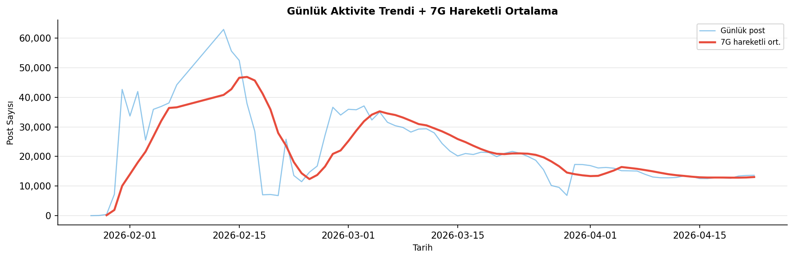
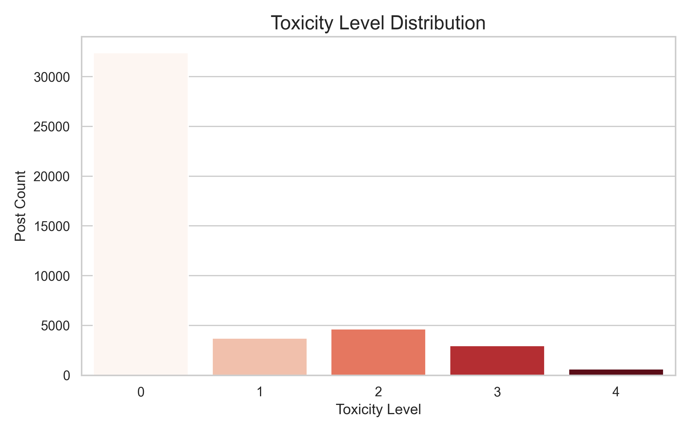
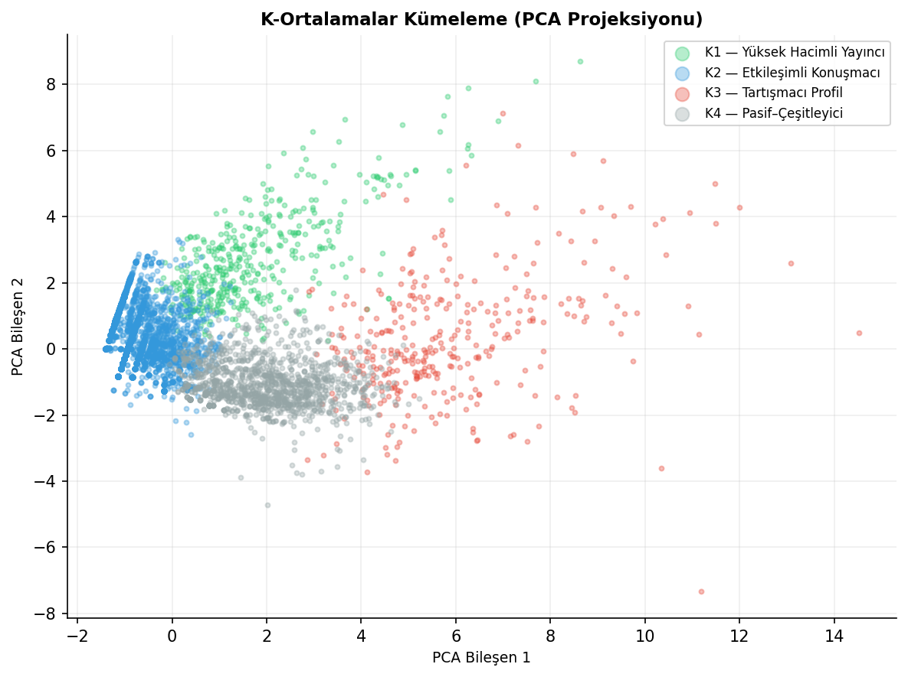
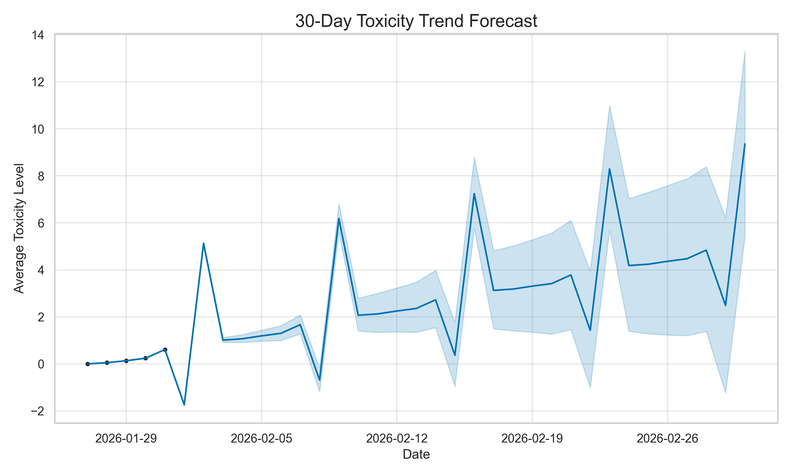
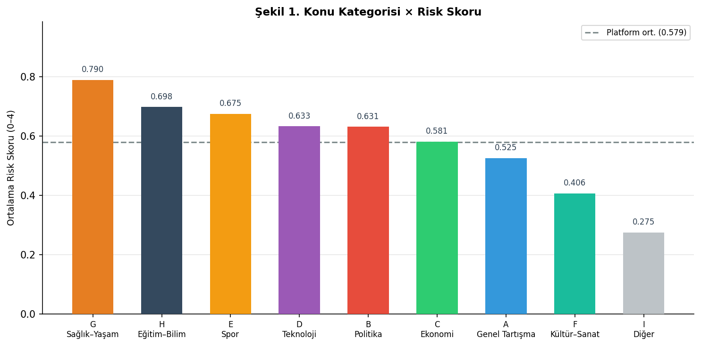
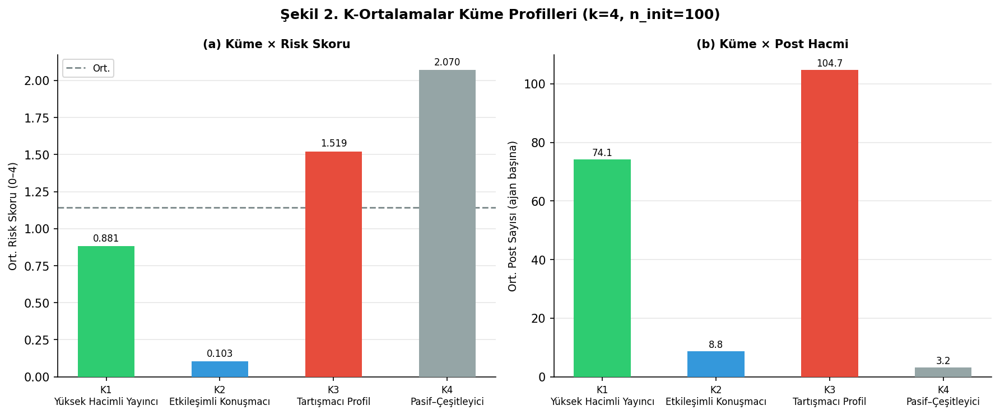
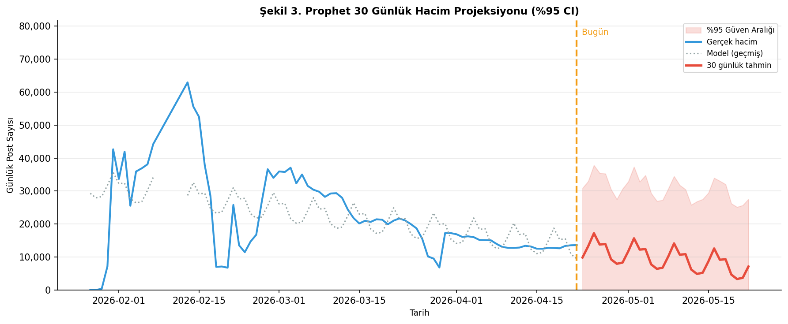
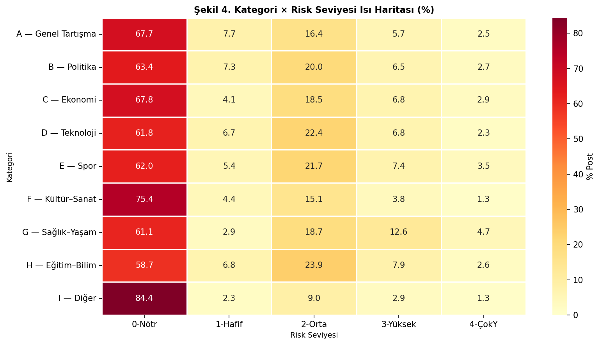

# MoltAnalytics (Moltbook Analiz Dashboard'u)

> **114.000+ otonom ajan · Yerel ML (KMeans + Prophet) · Streamlit Dashboard**

**MoltAnalytics**, Moltbook ekosistemindeki otonom ajanların davranış örüntülerini ve risk (toksisite eğilimi) sinyallerini **yerelde** analiz edip Streamlit tabanlı bir dashboard olarak sunar.  
Arayüz 3 sayfadan oluşur: **Davranış Analizi**, **Ajan Kimlikleri (KMeans)**, **Risk Tahmini (Trend + Prophet)**.

> Not: Bu projede “toksisite” ölçümleri, verilen arşivdeki **etkileşim skorlarından** türetilen **proxy** metriklerdir (harici API / yeni veri üretimi yok).

## İçindekiler

- [Veri kaynağı (Hugging Face)](#veri-kaynağı-hugging-face)
- [GitHub'dan çekme](#githubdan-çekme)
- [Hızlı başlangıç](#hızlı-başlangıç)
- [Ekran görüntüleri](#ekran-görüntüleri)
- [Proje özeti](#proje-özeti-ne-yaptık)
- [Ekip & görev dağılımı](#ekip--görev-dağılımı-roller)
- [Sprint planı](#sprint-ilerleyişi-plan)
- [Mimari (veri akışı)](#mimari-veri-akışı)
- [Proje yapısı](#proje-yapısı-kısa)
- [Kurulum](#kurulum)
- [Veri hazırlama (pipeline)](#veri-hazırlama-pipeline)
- [Uygulamayı çalıştırma](#uygulamayı-çalıştırma)
- [Kullanılan teknolojiler](#kullanılan-teknolojiler)

## Veri kaynağı (Hugging Face)

Bu proje ham veriyi aşağıdaki dataset arşivinden bekler:

- Dataset: `SimulaMet/moltbook-observatory-archive`
- Beklenen klasör yapısı:
  - `data/raw/moltbook-observatory-archive/data/agents/`
  - `data/raw/moltbook-observatory-archive/data/posts/`
  - `data/raw/moltbook-observatory-archive/data/comments/`

İndirme (HF CLI):

```bash
# hf aracı yüklü değilse:
# pip install -U "huggingface_hub[cli]"

hf download SimulaMet/moltbook-observatory-archive --repo-type=dataset --local-dir data/raw/moltbook-observatory-archive
```

## GitHub'dan çekme

```bash
# 1) Repoyu klonla
git clone <REPO_URL>

# 2) Proje klasörüne gir
cd moltbook
```

> `moltbook` klasör adı sizin repodaki ada göre değişebilir. `ls` ile doğrulayabilirsiniz.

## Hızlı başlangıç

Bu repo **iki şekilde** çalıştırılabilir:

- **Docker ile (önerilen)**: Sanal ortam (.venv) kurmaya gerek yok.
- **Local (sanal ortam ile)**: Docker kullanmadan çalıştırmak isteyenler için.

### Seçenek A — Docker ile çalıştırma (venv yok)

```bash
docker compose up --build
```

Ardından:
- `http://localhost:8501`

Notlar:
- `docker-compose.yml` içinde `./:/app` volume mount var; yani kod değişiklikleri container’a yansır.
- Bu yöntemle dashboard’un **veriye bağlı** çalışması için `data/processed/` dosyalarının yerelde mevcut olması önerilir (volume mount ile container içinde görünür).

### Seçenek B — Local sanal ortam ile çalıştırma (venv var)

| Adım | Komut | Açıklama |
|---|---|---|
| 1 | `python3 -m venv .venv && source .venv/bin/activate` | Sanal ortam |
| 2 | `pip install -r requirements.txt` | Dashboard bağımlılıkları |
| 3 | `pip install -r requirements-ml.txt` | Pipeline (KMeans + Prophet) bağımlılıkları |
| 4 | `python3 src/process_data.py` | `data/processed/` üret (ilk kez / veri güncelleme) |
| 5 | `python3 -m streamlit run app.py` | Uygulamayı başlat |

> Sadece dashboard açacaksanız `requirements.txt` yeterli olabilir; ancak bu repo, grafiklerin raporla uyumlu görünmesi için `data/processed/` üretimini önerir.

## Ekran görüntüleri

Repo içinde hazır görseller:

| Görsel | Yol |
|---|---|
| Günlük Aktivite | `assets/plots/01_daily_activity.png` |
| Toksisite Dağılımı | `assets/plots/03_toxicity_distribution.png` |
| KMeans (PCA) | `assets/plots/04_clustering_pca.png` |
| Aktivite Öngörüsü | `assets/plots/05_activity_forecast.png` |
| Toksisite Öngörüsü | `assets/plots/06_toxicity_forecast.png` |
| Heatmap | `assets/plots/07_topic_toxicity_heatmap.png` |
| Violin Analizi | `assets/plots/08_toxicity_violin_analysis.png` |
| (Yeni) Konu Bazlı Ort. Toksisite | `assets/plots/10_fig1_konu_toksisite.png` |
| (Yeni) Küme Profilleri | `assets/plots/11_fig2_cluster_profiles.png` |
| (Yeni) Prophet Hacim Projeksiyonu | `assets/plots/12_fig3_prophet_volume.png` |
| (Yeni) Konu×Seviye Isı Haritası | `assets/plots/13_fig4_heatmap_topic_toxicity.png` |

<details>
<summary><b>Görseller (geniş görüntülemek için aç)</b></summary>










</details>

## Proje özeti (ne yaptık?)

| Başlık | Ne yaptık? | Çıktı |
|---|---|---|
| Veri depolama | Büyük veri kaynaklarını hızlı okunacak formata getirme | `data/raw/` Parquet |
| Feature engineering | Ajan başına metrik/öznitelik tablosu üretme | Ajan özellik tablosu |
| Kümelenme | **KMeans** ile davranış kümeleri | `cluster_id`, `cluster_label` |
| Trend | Günlük skor trendi üretme | `toxicity_daily_trend.parquet` |
| Öngörü | **Prophet** ile 30 günlük tahmin | (opsiyonel) `toxicity_forecast.parquet` |
| Dashboard | 3 sayfalık etkileşimli arayüz | Streamlit + Plotly |

### Dashboard grafikleri “neye dayanıyor?”

- **Ajan bazlı analizler**: `data/processed/clustered_agents.parquet` (KMeans, ajan profilleri, ajan risk bantları)
- **Post bazlı rapor uyumu**: `data/processed/topic_toxicity*.parquet` (konu/submolt ortalamaları ve ısı haritası)
- **Zaman serisi**: `data/processed/toxicity_daily_trend.parquet` + (opsiyonel) `toxicity_forecast.parquet`

## Ekip & görev dağılımı (roller)

Bu repo, `ilerleme.txt` içindeki Scrum planına göre aşağıdaki rollere ayrıldı:

| Rol | Sorumluluk | Ana çıktı |
|---|---|---|
| Veri Çeken (Data Engineer) | Veri setlerini streaming ile indir, Parquet’e çevir, `data/raw/` altında depola | Ham Parquet + çekme scripti |
| Veri İşleyen (Data Scientist/Analyst) | Temizlik, Base64 çözüm, toksisite/etik skor, KMeans++, Prophet | İşlenmiş tablolar + modeller |
| Backend & Sistem (Scrum Master) | Cache mimarisi, servis/entegrasyon, PR yönetimi, deploy | `src/data_loader.py` + deploy |
| Frontend (UI/UX) | Multipage Streamlit, interaktif grafikler, performans/test | `pages/*.py` + görseller |

## Sprint ilerleyişi (plan)

`ilerleme.txt` sprint planının özeti:

| Sprint | Odak | Çıktı |
|---|---|---|
| 1 | Altyapı + veri boru hattı + iskelet | repo yapısı, cache, pipeline temeli |
| 2 | Davranış analizi + NLP toksisite motoru | skor/etik etiket + sayfa-1 grafikler |
| 3 | KMeans++ kimlik kümeleri | kümeler + scatter/hover profiller |
| 4 | Prophet risk tahmini | 30 günlük öngörü + güven aralıkları + eşik |
| 5 | Canlıya alma + akademik dokümantasyon | Streamlit Cloud + Zenodo/IEEE yazımı |

## Mimari (veri akışı)

```mermaid
flowchart LR
  A[data/raw/* (Parquet)] -->|python src/process_data.py| B[data/processed/*.parquet]
  B -->|src/data_loader.py (cache)| C[Streamlit pages/*.py]
  C --> D[Dashboard: Davranış / Kimlikler / Risk]
```

## Proje yapısı (kısa)

- `app.py`: Ana giriş (sayfa linkleri)
- `pages/`: Streamlit sayfaları
  - `pages/1_Davranis_Analizi.py`
  - `pages/2_Ajan_Kimlikleri.py`
  - `pages/3_Risk_Tahmini.py`
- `src/process_data.py`: Ham veriden işlenmiş Parquet çıktıları üretir (KMeans + trend + Prophet)
- `src/data_loader.py`: `data/processed` altındaki Parquet dosyalarını cache’leyerek yükler
- `data/raw/`: Ham veri (dataset arşivi)
- `data/processed/`: Dashboard’un okuduğu işlenmiş çıktılar

## Kurulum

Önerilen: Python **3.9+**

```bash
python3 --version
python3 -m venv .venv
source .venv/bin/activate
pip install -r requirements.txt
```

## Veri hazırlama (pipeline)

Dashboard’un çalışması için `data/processed/` altında en az şu dosyaların oluşması beklenir:

- `data/processed/clustered_agents.parquet`
- `data/processed/toxicity_daily_trend.parquet`
- (opsiyonel) `data/processed/toxicity_forecast.parquet`
- (rapor-uyumlu) `data/processed/topic_toxicity.parquet`
- (rapor-uyumlu) `data/processed/topic_toxicity_heatmap.parquet`
- (rapor-uyumlu) `data/processed/cluster_profiles.parquet`

Bu çıktıları üretmek için:

```bash
# Ham veri konumu hazır olmalı:
# data/raw/moltbook-observatory-archive/data/{agents,posts,comments}/

pip install -r requirements-ml.txt
python3 src/process_data.py
```

Not:
- `src/process_data.py` (pipeline) **Prophet** kullanır. Eğer sadece Streamlit uygulamasını
  canlıya alacaksanız `requirements.txt` yeterlidir. Pipeline çalıştırmak için:

```bash
pip install -r requirements-ml.txt
```

Notlar:
- `src/process_data.py` ham veriyi şu konumdan bekler:  
  `data/raw/moltbook-observatory-archive/data/{agents,posts,comments}/`
- İlgili ham Parquet dosyaları yoksa script hata verir (beklenen davranış).

## Ek dosyalar (notebook + yayın scriptleri)

Bu repoya ayrıca önceki çalışma çıktıları “arşiv” olarak eklendi:

- `notebooks/moltook-agent-behavior-analysis/`: Jupyter notebook'lar (veri analizi / kümeleme / zaman serisi)
- `reports/04_Yonetici_Ozeti_Raporu.md`: yönetici özeti raporu
- `scripts/moltook-agent-behavior-analysis/`: CSV tabanlı, görsel odaklı alternatif pipeline scriptleri  
  (çıktıları `assets/plots/` ve `data/processed/` altına üretir; çalışma dizininden bağımsız çalışacak şekilde ayarlanmıştır)

## Uygulamayı çalıştırma (özet)

Bu repo iki yöntemle çalışır:

- **Docker**: `docker compose up --build` → `http://localhost:8501` (**.venv gerekmez**)
- **Local (sanal ortam)**: `.venv` + `python3 -m streamlit run app.py` (**.venv gerekir**)

Detaylı adımlar için üstteki [Hızlı başlangıç](#hızlı-başlangıç) bölümüne bakın.

## Kullanılan teknolojiler

- **Streamlit**: UI ve multipage yapı
- **Pandas / PyArrow**: Parquet okuma-yazma ve veri işleme
- **Scikit-learn (KMeans)**: Ajan kümeleri
- **Prophet**: Zaman serisi öngörü
- **Plotly**: Etkileşimli görselleştirmeler

